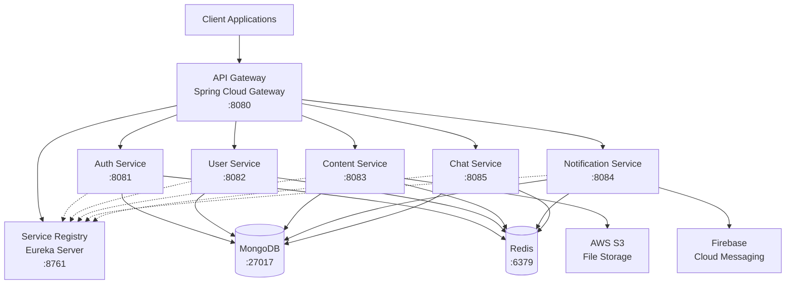

# CODIN Backend - Microservices Architecture

## 📋 목차
- [🎯 프로젝트 개요](#-프로젝트-개요)
- [🏗️ MSA 아키텍처](#️-msa-아키텍처)
- [🛠️ 기술 스택](#️-기술-스택)
- [🚀 Quick Start](#-quick-start)
- [📊 서비스 구성](#-서비스-구성)
- [📚 문서 및 가이드](#-문서-및-가이드)
- [🔧 개발 환경 설정](#-개발-환경-설정)
- [📈 아키텍처 진화 과정](#-아키텍처-진화-과정)

## 🎯 프로젝트 개요

**CODIN**은 인천대학교 정보기술대학 학생들을 위한 종합 플랫폼으로, **모놀리스 아키텍처에서 마이크로서비스 아키텍처(MSA)** 이전 중입니다.

- **프로젝트 링크**: [GitHub Organization](https://github.com/CodIN-INU) | [메인 페이지](https://codin.inu.ac.kr/login)
- **디자인**: [Figma 디자인](https://www.figma.com/design/Yd7fxwf1Y0LL03i6arejFt/CodIN?node-id=1806-19&t=RCzqo4PNunBsrZSI-1)
- **현재 상태**: MSA 전환 중 (2025년 6월)

## 🏗️ MSA 아키텍처

CODIN은 기존 모놀리스 구조에서 **6개의 독립적인 마이크로서비스**로 성공적으로 분리되었습니다.



### 🎯 MSA 주요 특징
- **API Gateway**: Spring Cloud Gateway를 통한 라우팅 및 로드밸런싱
- **Service Discovery**: Eureka Server를 통한 서비스 등록 및 발견
- **중앙 집중식 캐싱**: 공통 Redis 인스턴스
- **서비스 간 통신**: OpenFeign을 통한 HTTP 통신

**📖 자세한 아키텍처 설명**: [MSA 완전 가이드](./docs/README-MSA-COMPLETE.md)

## 🛠️ 기술 스택

### 🏗️ 백엔드 프레임워크
- **Java 17** - 프로그래밍 언어
- **Spring Boot 3.3.5** - 애플리케이션 프레임워크
- **Spring Cloud 2023.0.3** - 마이크로서비스 프레임워크
  - Spring Cloud Gateway - API Gateway
  - Spring Cloud Netflix Eureka - Service Discovery
  - Spring Cloud OpenFeign - 서비스 간 통신

### 🔐 보안 & 인증
- **Spring Security 6** - 보안 프레임워크
- **JWT (JSON Web Token)** - 토큰 기반 인증
- **OAuth2** - 소셜 로그인

### 💾 데이터베이스 & 캐싱
- **MongoDB** - NoSQL 데이터베이스
- **Redis** - 인메모리 캐싱 및 토큰 스토어

### ☁️ 클라우드 & 인프라
- **AWS S3** - 파일 저장소
- **Firebase Cloud Messaging (FCM)** - 푸시 알림
- **Docker** - 컨테이너화

### 🛠️ 개발 도구
- **Gradle** - 빌드 도구
- **Swagger/OpenAPI 3** - API 문서화
- **WebSocket** - 실시간 통신

## 🚀 Quick Start

### 📋 사전 요구사항
- Java 17+
- Docker & Docker Compose
- Git

### 🏃‍♂️ 빠른 실행

```bash
# 1. 저장소 클론
git clone https://github.com/CodIN-INU/BACKEND.git
cd BACKEND

# 2. 인프라 서비스 시작 (MongoDB, Redis)
docker-compose up -d mongodb redis

# 3. Service Registry 시작
./gradlew :modules:codin-service-registry:bootRun

# 4. API Gateway 시작
./gradlew :modules:codin-api-gateway:bootRun

# 5. 나머지 서비스들 시작
./gradlew :modules:codin-auth-service:bootRun
./gradlew :modules:codin-user-service:bootRun
./gradlew :modules:codin-content-service:bootRun
./gradlew :modules:codin-notification-service:bootRun
./gradlew :modules:codin-chat-service:bootRun
```

### 📊 서비스 확인
- **Eureka Dashboard**: http://localhost:8761
- **API Gateway**: http://localhost:8080
- **Service Health**: http://localhost:8080/actuator/health

## 📊 서비스 구성

| 서비스 | 포트 | 역할 | 상태 |
|--------|------|------|------|
| **Service Registry** | 8761 | Eureka Server - 서비스 등록/발견 | ✅ 완료 |
| **API Gateway** | 8080 | Spring Cloud Gateway - 라우팅 | ✅ 완료 |
| **Auth Service** | 8081 | 인증/인가, JWT 토큰 관리 |  |
| **User Service** | 8082 | 사용자 정보 관리, 프로필 |  |
| **Content Service** | 8083 | 게시판, 댓글, 파일 업로드 |  |
| **Notification Service** | 8084 | FCM 푸시 알림, 이메일 |  |
| **Chat Service** | 8085 | 실시간 채팅, WebSocket |  |

### 🎯 주요 기능
- **사용자 인증 및 권한 관리** (JWT, OAuth2)
- **실시간 통신** (WebSocket)
- **파일 저장 및 관리** (AWS S3)
- **푸시 알림** (Firebase Cloud Messaging)
- **이메일 서비스**
- **API 문서화** (Swagger)
- **요청 제한** (Rate Limiting - Bucket4j)
- **서비스 간 통신** (OpenFeign)

## 📚 WIKI 문서 및 가이드

### 📖 아키텍처 문서
- [**MSA 완전 가이드**](./docs/README-MSA-COMPLETE.md) - 마이크로서비스 아키텍처 상세 설명
- [**Spring Cloud Gateway 가이드**](./docs/gateway-guide.md) - API Gateway 설정 및 라우팅
- [**Eureka Service Discovery**](./docs/eureka-guide.md) - 서비스 등록/발견 가이드

### 📋 서비스별 문서
- [**Auth Service**](./modules/codin-auth-service/README.md) - 인증/인가 서비스
- [**User Service**](./modules/codin-user-service/README.md) - 사용자 관리 서비스
- [**Content Service**](./modules/codin-content-service/README.md) - 콘텐츠 관리 서비스
- [**Notification Service**](./modules/codin-notification-service/README.md) - 알림 서비스
- [**Chat Service**](./modules/codin-chat-service/README.md) - 채팅 서비스

### 🛠️ 개발 가이드
- [**로컬 개발 환경 설정**](./docs/development-setup.md)
- [**Docker 컨테이너 가이드**](./docs/docker-guide.md)

## 🔧 개발 환경 설정

### 🏗️ 프로젝트 구조
```
BACKEND/
├── modules/                    # 마이크로서비스 모듈들
│   ├── codin-service-registry/ # Eureka 서버
│   ├── codin-api-gateway/      # API Gateway
│   ├── codin-auth-service/     # 인증 서비스
│   ├── codin-user-service/     # 사용자 서비스
│   ├── codin-content-service/  # 콘텐츠 서비스
│   ├── codin-notification-service/ # 알림 서비스
│   └── codin-chat-service/     # 채팅 서비스
├── common/                     # 공통 라이브러리
├── docs/                       # 문서
├── docker-compose.yml          # Docker 구성
├── build.gradle               # 루트 빌드 설정
└── settings.gradle            # 프로젝트 설정
```

### 🐳 Docker 개발 환경

```bash
# 전체 서비스 시작
docker-compose up -d

# 특정 서비스만 시작
docker-compose up -d mongodb redis

# 로그 확인
docker-compose logs -f [service-name]

# 서비스 중지
docker-compose down
```

### ⚙️ 환경 변수 설정

각 서비스별 `application.yml` 또는 환경 변수로 설정:

```yaml
# 공통 설정
eureka:
  client:
    service-url:
      defaultZone: http://localhost:8761/eureka/

spring:
  data:
    mongodb:
      uri: mongodb://localhost:27017/codin
  data:
    redis:
      host: localhost
      port: 6379
```

## 📈 아키텍처 진화 과정

### 🔄 모놀리스 → MSA 전환 과정

1. **Phase 1**: 모놀리스 구조 분석 및 도메인 분리
2. **Phase 2**: Spring Cloud 인프라 구성
   - Eureka Server 구축 ✅
   - API Gateway 구현 ✅
3. **Phase 3**: 서비스 분리 및 독립성 확보
   - Auth Service 분리 
   - User Service 분리 
   - Content Service 분리 
   - Notification Service 분리 
   - Chat Service 분리 
4. **Phase 4**: 데이터 분리 및 통신 최적화
   - 서비스별 데이터베이스 분리 
   - OpenFeign을 통한 서비스 간 통신 

### 🎯 주요 예상 성과

- ✅ **서비스 독립성**: 각 서비스가 독립적으로 개발/배포 가능
- ✅ **확장성**: 필요에 따라 개별 서비스 스케일링 가능
- ✅ **장애 격리**: 한 서비스의 장애가 전체 시스템에 영향 주지 않음
- ✅ **기술 다양성**: 서비스별로 최적의 기술 스택 선택 가능

### 🔮 향후 계획

- [ ] **서비스 메시 도입** (Istio/Consul Connect)
- [ ] **분산 트레이싱** (Zipkin/Jaeger)
- [ ] **중앙 집중식 로깅** (ELK Stack)
- [ ] **CI/CD 파이프라인** 고도화
- [ ] **Kubernetes** 마이그레이션

---

## 🏆 주요 기여자

### MSA 전환 프로젝트 (2025.06 ~)
- **Architecture Design**: MSA 설계 및 서비스 분리
- **Infrastructure Setup**: Spring Cloud 인프라 구성
- **Service Development**: 마이크로서비스 개발 및 통합

### 기존 모놀리스 개발 (2024.10 ~ 2025.05)
- **알림 서비스 개발**: Firebase Cloud Messaging 통합
- **사용자 관리 시스템**: 인증/인가 및 프로필 관리
- **시스템 최적화**: Rate Limiting, Redis 캐싱
- **인프라 구축**: Docker, 모니터링 시스템
- **CI/CD 파이프라인**: GitHub Actions 자동화

---

**📞 Contact**: CODIN 개발팀 | [GitHub Issues](https://github.com/CodIN-INU/BACKEND/issues)