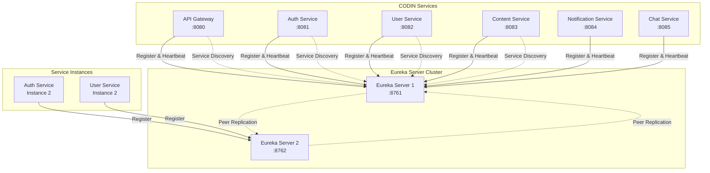

# Eureka Service Discovery 가이드

## 📋 목차
- [🎯 Eureka 개요](#-eureka-개요)
- [🏗️ 서비스 발견 아키텍처](#️-서비스-발견-아키텍처)
- [⚙️ Eureka Server 설정](#️-eureka-server-설정)
- [🔗 Service Registration](#-service-registration)
- [🔍 Service Discovery](#-service-discovery)
- [💪 고가용성 구성](#-고가용성-구성)
- [📊 모니터링 및 관리](#-모니터링-및-관리)
- [🛠️ 트러블슈팅](#️-트러블슈팅)

## 🎯 Eureka 개요

Eureka는 Netflix에서 개발한 **서비스 발견(Service Discovery)** 시스템으로, CODIN MSA에서 각 마이크로서비스의 위치를 동적으로 관리하고 서비스 간 통신을 가능하게 합니다.

### 주요 기능
- **서비스 등록**: 각 마이크로서비스가 자신의 위치 정보를 등록
- **서비스 발견**: 다른 서비스의 위치 정보를 조회
- **헬스 체크**: 서비스 인스턴스의 상태 모니터링
- **로드 밸런싱**: 여러 인스턴스 간 요청 분산
- **장애 감지**: 비정상 서비스 인스턴스 자동 제거
- **동적 스케일링**: 서비스 인스턴스 동적 추가/제거

### 포트 및 접근 정보
- **Eureka Server Port**: 8761
- **Eureka Dashboard**: http://localhost:8761
- **REST API**: http://localhost:8761/eureka/apps
- **Instance Info**: http://localhost:8761/eureka/apps/{APP_NAME}

## 🏗️ 서비스 발견 아키텍처



### 서비스 등록 흐름
1. **서비스 시작**: 각 마이크로서비스가 시작될 때 Eureka Server에 자신의 정보 등록
2. **헬스 체크**: 30초마다 Eureka Server에 heartbeat 전송
3. **레지스트리 업데이트**: Eureka Server가 모든 클라이언트에게 서비스 목록 배포
4. **서비스 발견**: 다른 서비스 호출 시 Eureka에서 대상 서비스 위치 조회

## ⚙️ Eureka Server 설정

### application.yml 설정

```yaml
server:
  port: 8761

spring:
  application:
    name: eureka-server
  profiles:
    active: standalone

eureka:
  instance:
    hostname: localhost
    prefer-ip-address: false
  client:
    register-with-eureka: false    # 자기 자신을 등록하지 않음
    fetch-registry: false          # 다른 서비스 정보를 가져오지 않음
    service-url:
      defaultZone: http://localhost:8761/eureka/
  server:
    enable-self-preservation: true  # 네트워크 파티션 보호 모드
    eviction-interval-timer-in-ms: 60000  # 만료된 인스턴스 제거 간격
    renewal-percent-threshold: 0.85      # 갱신 임계값
    
management:
  endpoints:
    web:
      exposure:
        include: health,info,metrics,env
  endpoint:
    health:
      show-details: always

logging:
  level:
    com.netflix.eureka: INFO
    com.netflix.discovery: INFO
```

### Main Application 클래스

```java
@SpringBootApplication
@EnableEurekaServer
public class EurekaServerApplication {
    public static void main(String[] args) {
        SpringApplication.run(EurekaServerApplication.class, args);
    }
}
```

### Dependencies (pom.xml)

```xml
<dependencies>
    <dependency>
        <groupId>org.springframework.cloud</groupId>
        <artifactId>spring-cloud-starter-netflix-eureka-server</artifactId>
    </dependency>
    <dependency>
        <groupId>org.springframework.boot</groupId>
        <artifactId>spring-boot-starter-actuator</artifactId>
    </dependency>
    <dependency>
        <groupId>org.springframework.boot</groupId>
        <artifactId>spring-boot-starter-security</artifactId>
    </dependency>
</dependencies>
```

## 🔗 Service Registration

### 각 마이크로서비스의 Eureka Client 설정

#### Auth Service 설정 예시

```yaml
# auth-service/src/main/resources/application.yml
server:
  port: 8081

spring:
  application:
    name: codin-auth-service

eureka:
  client:
    service-url:
      defaultZone: http://localhost:8761/eureka/
    register-with-eureka: true
    fetch-registry: true
    registry-fetch-interval-seconds: 30
  instance:
    prefer-ip-address: true
    instance-id: ${spring.application.name}:${server.port}
    lease-renewal-interval-in-seconds: 30    # 하트비트 간격
    lease-expiration-duration-in-seconds: 90 # 만료 시간
    metadata-map:
      version: 1.0.0
      team: codin-backend
      environment: development
```

#### Client 애플리케이션 클래스

```java
@SpringBootApplication
@EnableEurekaClient
@EnableDiscoveryClient
public class AuthServiceApplication {
    public static void main(String[] args) {
        SpringApplication.run(AuthServiceApplication.class, args);
    }
}
```

### 서비스별 등록 정보

| 서비스명 | Application Name | Port | Instance ID |
|---------|------------------|------|-------------|
| Gateway | codin-gateway | 8080 | codin-gateway:8080 |
| Auth | codin-auth-service | 8081 | codin-auth-service:8081 |
| User | codin-user-service | 8082 | codin-user-service:8082 |
| Content | codin-content-service | 8083 | codin-content-service:8083 |
| Notification | codin-notification-service | 8084 | codin-notification-service:8084 |
| Chat | codin-chat-service | 8085 | codin-chat-service:8085 |

## 🔍 Service Discovery

### Programmatic Service Discovery

#### RestTemplate with Ribbon

```java
@Configuration
public class RestTemplateConfig {
    
    @Bean
    @LoadBalanced  // Ribbon 로드 밸런싱 활성화
    public RestTemplate restTemplate() {
        return new RestTemplate();
    }
}

@Service
public class UserServiceClient {
    
    @Autowired
    private RestTemplate restTemplate;
    
    public UserDto getUser(Long userId) {
        String url = "http://codin-user-service/api/users/" + userId;
        return restTemplate.getForObject(url, UserDto.class);
    }
}
```

#### OpenFeign Client

```java
@FeignClient(name = "codin-user-service")
public interface UserServiceClient {
    
    @GetMapping("/api/users/{userId}")
    UserDto getUser(@PathVariable Long userId);
    
    @PostMapping("/api/users")
    UserDto createUser(@RequestBody CreateUserRequest request);
}

@Service
public class AuthService {
    
    @Autowired
    private UserServiceClient userServiceClient;
    
    public void validateUser(Long userId) {
        UserDto user = userServiceClient.getUser(userId);
        // 사용자 검증 로직
    }
}
```

#### WebClient with Load Balancer

```java
@Configuration
public class WebClientConfig {
    
    @Bean
    @LoadBalanced
    public WebClient.Builder webClientBuilder() {
        return WebClient.builder();
    }
}

@Service
public class ContentServiceClient {
    
    private final WebClient webClient;
    
    public ContentServiceClient(WebClient.Builder webClientBuilder) {
        this.webClient = webClientBuilder.build();
    }
    
    public Mono<List<PostDto>> getUserPosts(Long userId) {
        return webClient.get()
                .uri("http://codin-content-service/api/posts/user/{userId}", userId)
                .retrieve()
                .bodyToFlux(PostDto.class)
                .collectList();
    }
}
```

### Discovery Client API

```java
@Service
public class ServiceDiscoveryService {
    
    @Autowired
    private DiscoveryClient discoveryClient;
    
    public List<String> getServices() {
        return discoveryClient.getServices();
    }
    
    public List<ServiceInstance> getServiceInstances(String serviceName) {
        return discoveryClient.getInstances(serviceName);
    }
    
    public String getServiceUrl(String serviceName) {
        List<ServiceInstance> instances = discoveryClient.getInstances(serviceName);
        if (!instances.isEmpty()) {
            ServiceInstance instance = instances.get(0);
            return "http://" + instance.getHost() + ":" + instance.getPort();
        }
        throw new RuntimeException("Service not available: " + serviceName);
    }
}
```

## 💪 고가용성 구성

### Eureka Server 클러스터 구성

#### Peer 1 설정 (eureka-peer1.yml)

```yaml
server:
  port: 8761

spring:
  application:
    name: eureka-server
  profiles:
    active: peer1

eureka:
  instance:
    hostname: eureka-peer1
    prefer-ip-address: false
  client:
    register-with-eureka: true
    fetch-registry: true
    service-url:
      defaultZone: http://eureka-peer2:8762/eureka/
  server:
    enable-self-preservation: true
    peer-eureka-nodes-update-interval-ms: 10000
```

#### Peer 2 설정 (eureka-peer2.yml)

```yaml
server:
  port: 8762

spring:
  application:
    name: eureka-server
  profiles:
    active: peer2

eureka:
  instance:
    hostname: eureka-peer2
    prefer-ip-address: false
  client:
    register-with-eureka: true
    fetch-registry: true
    service-url:
      defaultZone: http://eureka-peer1:8761/eureka/
  server:
    enable-self-preservation: true
```

#### 클라이언트에서 다중 Eureka Server 설정

```yaml
eureka:
  client:
    service-url:
      defaultZone: http://eureka-peer1:8761/eureka/,http://eureka-peer2:8762/eureka/
    registry-fetch-interval-seconds: 10
    eureka-service-url-poll-interval-seconds: 60
```

### Self-Preservation Mode

Eureka Server는 네트워크 문제로 인한 대량의 서비스 해제를 방지하기 위해 Self-Preservation 모드를 제공합니다.

```yaml
eureka:
  server:
    enable-self-preservation: true
    renewal-percent-threshold: 0.85  # 85% 미만 갱신 시 보호 모드 활성화
    expected-client-renewal-interval-seconds: 30
```

## 📊 모니터링 및 관리

### Eureka Dashboard

Eureka Server는 웹 기반 대시보드를 제공합니다:

- **URL**: http://localhost:8761
- **기능**:
  - 등록된 서비스 목록 조회
  - 서비스 인스턴스 상태 확인
  - 레지스트리 정보 실시간 모니터링
  - Self-Preservation 모드 상태 확인

### REST API 엔드포인트

#### 모든 애플리케이션 조회
```bash
curl -X GET http://localhost:8761/eureka/apps
```

#### 특정 애플리케이션 조회
```bash
curl -X GET http://localhost:8761/eureka/apps/CODIN-USER-SERVICE
```

#### 특정 인스턴스 조회
```bash
curl -X GET http://localhost:8761/eureka/apps/CODIN-USER-SERVICE/codin-user-service:8082
```

#### 서비스 등록 해제
```bash
curl -X DELETE http://localhost:8761/eureka/apps/CODIN-USER-SERVICE/codin-user-service:8082
```

### Actuator 엔드포인트

```yaml
management:
  endpoints:
    web:
      exposure:
        include: health,info,metrics,env,eureka
  endpoint:
    health:
      show-details: always
```

**사용 가능한 엔드포인트**:
- `/actuator/health`: 서버 상태 확인
- `/actuator/info`: 서버 정보
- `/actuator/metrics`: 메트릭 정보
- `/actuator/env`: 환경 변수 정보

### 모니터링 메트릭

#### Custom Metrics 구성

```java
@Component
public class EurekaMetrics {
    
    private final MeterRegistry meterRegistry;
    private final EurekaClient eurekaClient;
    
    public EurekaMetrics(MeterRegistry meterRegistry, EurekaClient eurekaClient) {
        this.meterRegistry = meterRegistry;
        this.eurekaClient = eurekaClient;
        
        Gauge.builder("eureka.registered.instances")
                .description("Number of registered instances")
                .register(meterRegistry, this, EurekaMetrics::getRegisteredInstancesCount);
    }
    
    private double getRegisteredInstancesCount() {
        return eurekaClient.getApplications().getRegisteredApplications().size();
    }
}
```

## 🛠️ 트러블슈팅

### 일반적인 문제들

#### 1. 서비스가 Eureka에 등록되지 않음

**증상**: 서비스가 시작되었지만 Eureka 대시보드에 표시되지 않음

**해결책**:
```yaml
eureka:
  client:
    register-with-eureka: true  # 확인
    service-url:
      defaultZone: http://localhost:8761/eureka/  # URL 확인
  instance:
    prefer-ip-address: true
    lease-renewal-interval-in-seconds: 10  # 더 짧은 간격으로 설정
```

#### 2. 서비스 발견이 안 됨

**증상**: 다른 서비스 호출 시 "Unknown host" 오류

**해결책**:
```yaml
eureka:
  client:
    fetch-registry: true  # 확인
    registry-fetch-interval-seconds: 10  # 더 짧은 간격
```

#### 3. Self-Preservation 모드 문제

**증상**: 서비스가 종료되었는데도 Eureka에서 제거되지 않음

**해결책**:
```yaml
# 개발 환경에서만 사용
eureka:
  server:
    enable-self-preservation: false
    eviction-interval-timer-in-ms: 10000
```

#### 4. 네트워크 지연으로 인한 등록 지연

**해결책**:
```yaml
eureka:
  instance:
    lease-renewal-interval-in-seconds: 10
    lease-expiration-duration-in-seconds: 30
  client:
    initial-instance-info-replication-interval-seconds: 10
    instance-info-replication-interval-seconds: 10
```

### 로그 분석

#### Eureka Server 로그 레벨 설정

```yaml
logging:
  level:
    com.netflix.eureka: DEBUG
    com.netflix.discovery: DEBUG
    org.springframework.cloud.netflix.eureka: DEBUG
```

#### 주요 로그 패턴

```bash
# 정상 등록
CODIN-AUTH-SERVICE registered with Eureka Server

# 하트비트 수신
Received heartbeat from CODIN-AUTH-SERVICE

# 서비스 만료
Expired lease for CODIN-AUTH-SERVICE

# Self-Preservation 모드
EMERGENCY! EUREKA MAY BE INCORRECTLY CLAIMING INSTANCES ARE UP
```

### 성능 최적화

#### 등록 시간 단축

```yaml
eureka:
  instance:
    lease-renewal-interval-in-seconds: 10    # 기본값: 30
    lease-expiration-duration-in-seconds: 30 # 기본값: 90
  client:
    registry-fetch-interval-seconds: 10      # 기본값: 30
    initial-instance-info-replication-interval-seconds: 10  # 기본값: 40
```

#### 메모리 최적화

```yaml
eureka:
  server:
    max-idle-registry-seconds: 60
    response-cache-auto-expiration-in-seconds: 30
    response-cache-update-interval-ms: 10000
```

## 🎯 Best Practices

### 1. 서비스 명명 규칙
- **애플리케이션 이름**: kebab-case 사용 (`codin-auth-service`)
- **인스턴스 ID**: `${spring.application.name}:${server.port}` 형식
- **메타데이터**: 버전, 팀, 환경 정보 포함

### 2. 헬스 체크 설정
```yaml
eureka:
  instance:
    health-check-url-path: /actuator/health
    status-page-url-path: /actuator/info
    lease-renewal-interval-in-seconds: 30
    lease-expiration-duration-in-seconds: 90
```

### 3. 보안 고려사항
```yaml
# Eureka Server 보안
security:
  basic:
    enabled: true
  user:
    name: admin
    password: ${EUREKA_PASSWORD:secret}
```

### 4. 환경별 설정 분리
```yaml
# application-local.yml
eureka:
  server:
    enable-self-preservation: false

# application-prod.yml
eureka:
  server:
    enable-self-preservation: true
    renewal-percent-threshold: 0.85
```

---

**참고 문서**:
- [Spring Cloud Netflix Eureka](https://spring.io/projects/spring-cloud-netflix)
- [Netflix Eureka Wiki](https://github.com/Netflix/eureka/wiki)
- [Gateway Guide](./gateway-guide.md)
- [MSA Complete Guide](./README-MSA-COMPLETE.md)
