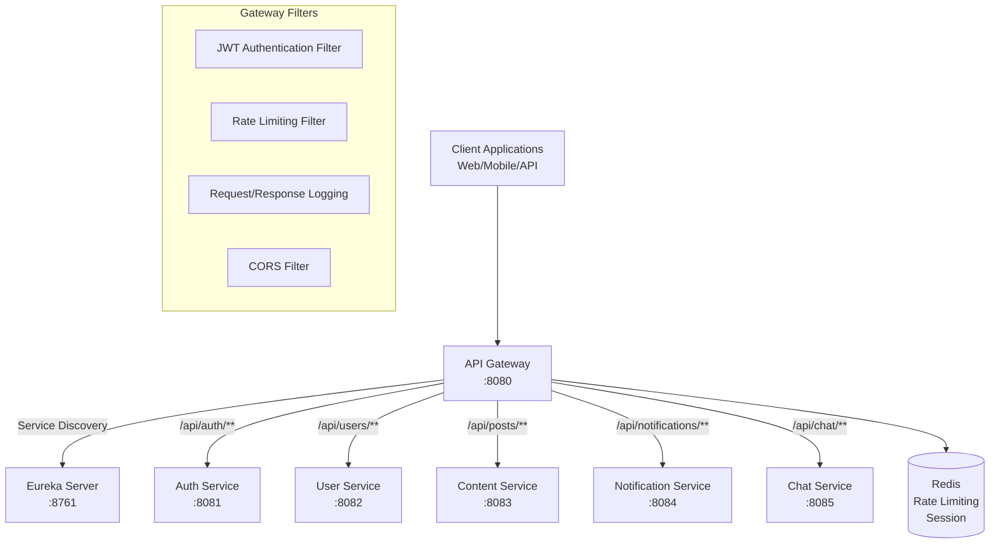

# Spring Cloud Gateway 가이드

## 📋 목차
- [🎯 Gateway 개요](#-gateway-개요)
- [🏗️ 아키텍처 구조](#️-아키텍처-구조)
- [⚙️ 설정 및 구성](#️-설정-및-구성)
- [🛣️ 라우팅 설정](#️-라우팅-설정)
- [🔐 보안 및 인증](#-보안-및-인증)
- [🚦 필터 및 미들웨어](#-필터-및-미들웨어)
- [📊 모니터링 및 로깅](#-모니터링-및-로깅)

## 🎯 Gateway 개요

Spring Cloud Gateway는 CODIN MSA의 **단일 진입점**으로, 모든 클라이언트 요청을 받아 적절한 마이크로서비스로 라우팅하는 역할을 담당합니다.

### 주요 기능
- **라우팅**: 요청 URL 패턴에 따른 서비스 분기
- **로드밸런싱**: Eureka와 연동한 서비스 인스턴스 분산
- **인증/인가**: JWT 토큰 검증 및 사용자 권한 확인
- **Rate Limiting**: API 호출 빈도 제한
- **요청/응답 변환**: 헤더 추가/제거, 경로 재작성
- **Circuit Breaking**: 장애 서비스 격리
- **CORS 처리**: 크로스 오리진 요청 관리

### 포트 및 접근 정보
- **Gateway Port**: 8080
- **관리 엔드포인트**: http://localhost:8080/actuator
- **라우팅 정보**: http://localhost:8080/actuator/gateway/routes

## 🏗️ 아키텍처 구조



## ⚙️ 설정 및 구성

### application.yml 설정
```yaml
# modules/codin-api-gateway/src/main/resources/application.yml

server:
  port: 8080

spring:
  application:
    name: api-gateway
  
  cloud:
    gateway:
      # 글로벌 CORS 설정
      globalcors:
        cors-configurations:
          '[/**]':
            allowed-origins: 
              - "http://localhost:3000"
              - "https://codin.inu.ac.kr"
            allowed-methods:
              - GET
              - POST
              - PUT
              - DELETE
              - OPTIONS
            allowed-headers: "*"
            allow-credentials: true
            max-age: 3600
      
      # 라우팅 설정
      routes:
        # Auth Service 라우팅
        - id: auth-service
          uri: lb://auth-service
          predicates:
            - Path=/api/auth/**
          filters:
            - RewritePath=/api/auth/(?<path>.*), /$\{path}
            - name: RequestRateLimiter
              args:
                redis-rate-limiter.replenishRate: 10
                redis-rate-limiter.burstCapacity: 20
                key-resolver: "#{@ipKeyResolver}"
        
        # User Service 라우팅
        - id: user-service
          uri: lb://user-service
          predicates:
            - Path=/api/users/**
          filters:
            - RewritePath=/api/users/(?<path>.*), /$\{path}
            - JwtAuthenticationFilter
            - name: RequestRateLimiter
              args:
                redis-rate-limiter.replenishRate: 20
                redis-rate-limiter.burstCapacity: 40
        
        # Content Service 라우팅
        - id: content-service
          uri: lb://content-service
          predicates:
            - Path=/api/posts/**, /api/comments/**, /api/lectures/**
          filters:
            - RewritePath=/api/(?<service>posts|comments|lectures)/(?<path>.*), /$\{service}/$\{path}
            - JwtAuthenticationFilter
        
        # Notification Service 라우팅
        - id: notification-service
          uri: lb://notification-service
          predicates:
            - Path=/api/notifications/**
          filters:
            - RewritePath=/api/notifications/(?<path>.*), /$\{path}
            - JwtAuthenticationFilter
        
        # Chat Service 라우팅
        - id: chat-service
          uri: lb://chat-service
          predicates:
            - Path=/api/chat/**, /ws/chat/**
          filters:
            - RewritePath=/api/chat/(?<path>.*), /$\{path}
            - JwtAuthenticationFilter

  # Redis 설정 (Rate Limiting용)
  data:
    redis:
      host: ${REDIS_HOST:localhost}
      port: ${REDIS_PORT:6379}
      password: ${REDIS_PASSWORD:}

# Eureka 클라이언트 설정
eureka:
  client:
    service-url:
      defaultZone: http://localhost:8761/eureka/
    fetch-registry: true
    register-with-eureka: true
  instance:
    prefer-ip-address: true
    instance-id: ${spring.application.name}:${server.port}

# 관리 엔드포인트 설정
management:
  endpoints:
    web:
      exposure:
        include: health,info,gateway
  endpoint:
    health:
      show-details: always
    gateway:
      enabled: true

# 로깅 설정
logging:
  level:
    org.springframework.cloud.gateway: DEBUG
    org.springframework.web.reactive: DEBUG
    reactor.netty: DEBUG
```

## 🛣️ 라우팅 설정

### 라우팅 규칙 정의

#### 1. 경로 기반 라우팅
```yaml
# 정확한 경로 매칭
- Path=/api/auth/login

# 와일드카드 매칭
- Path=/api/users/**

# 다중 경로 매칭
- Path=/api/posts/**, /api/comments/**
```

#### 2. 헤더 기반 라우팅
```yaml
predicates:
  - Path=/api/admin/**
  - Header=X-Request-Source, admin-panel
```

#### 3. 쿼리 파라미터 기반 라우팅
```yaml
predicates:
  - Path=/api/search/**
  - Query=type, advanced
```

### 동적 라우팅 설정

```java
// GatewayConfig.java
@Configuration
public class GatewayConfig {
    
    @Bean
    public RouteLocator customRouteLocator(RouteLocatorBuilder builder) {
        return builder.routes()
            // Auth Service 라우팅
            .route("auth-service", r -> r
                .path("/api/auth/**")
                .filters(f -> f
                    .rewritePath("/api/auth/(?<path>.*)", "/${path}")
                    .addRequestHeader("X-Gateway-Source", "api-gateway")
                    .circuitBreaker(config -> config
                        .setName("auth-service-cb")
                        .setFallbackUri("forward:/fallback/auth")
                    )
                )
                .uri("lb://auth-service")
            )
            
            // 파일 업로드 전용 라우팅 (큰 파일 처리)
            .route("file-upload", r -> r
                .path("/api/files/**")
                .and()
                .method(HttpMethod.POST)
                .filters(f -> f
                    .rewritePath("/api/files/(?<path>.*)", "/files/${path}")
                    .modifyRequestBody(String.class, String.class, 
                        (exchange, body) -> Mono.just(body))
                )
                .uri("lb://content-service")
            )
            
            // WebSocket 라우팅
            .route("websocket-chat", r -> r
                .path("/ws/chat/**")
                .filters(f -> f
                    .rewritePath("/ws/chat/(?<path>.*)", "/chat/${path}")
                )
                .uri("lb://chat-service")
            )
            .build();
    }
}
```

## 🔐 보안 및 인증

### JWT 인증 필터

```java
// JwtAuthenticationFilter.java
@Component
public class JwtAuthenticationFilter implements GatewayFilter, Ordered {
    
    private final JwtTokenProvider jwtTokenProvider;
    private final RedisTemplate<String, String> redisTemplate;
    
    @Override
    public Mono<Void> filter(ServerWebExchange exchange, GatewayFilterChain chain) {
        ServerHttpRequest request = exchange.getRequest();
        
        // 인증이 필요없는 경로 확인
        if (isPublicPath(request.getPath().toString())) {
            return chain.filter(exchange);
        }
        
        // JWT 토큰 추출
        String token = extractToken(request);
        
        if (token == null) {
            return handleUnauthorized(exchange, "Missing JWT token");
        }
        
        // 토큰 검증
        return validateToken(token)
            .flatMap(isValid -> {
                if (isValid) {
                    // 사용자 정보를 헤더에 추가
                    ServerHttpRequest modifiedRequest = request.mutate()
                        .header("X-User-Id", extractUserId(token))
                        .header("X-User-Roles", extractUserRoles(token))
                        .build();
                    
                    return chain.filter(exchange.mutate().request(modifiedRequest).build());
                } else {
                    return handleUnauthorized(exchange, "Invalid JWT token");
                }
            })
            .onErrorResume(throwable -> 
                handleUnauthorized(exchange, "Token validation failed: " + throwable.getMessage())
            );
    }
    
    private boolean isPublicPath(String path) {
        List<String> publicPaths = Arrays.asList(
            "/api/auth/login",
            "/api/auth/signup", 
            "/api/auth/oauth2",
            "/actuator/health",
            "/swagger-ui",
            "/api-docs"
        );
        
        return publicPaths.stream().anyMatch(path::startsWith);
    }
    
    private String extractToken(ServerHttpRequest request) {
        String authHeader = request.getHeaders().getFirst(HttpHeaders.AUTHORIZATION);
        if (authHeader != null && authHeader.startsWith("Bearer ")) {
            return authHeader.substring(7);
        }
        return null;
    }
    
    private Mono<Boolean> validateToken(String token) {
        return Mono.fromCallable(() -> {
            // Redis에서 블랙리스트 확인
            Boolean isBlacklisted = redisTemplate.hasKey("blacklist:" + token);
            if (Boolean.TRUE.equals(isBlacklisted)) {
                return false;
            }
            
            // JWT 토큰 유효성 검증
            return jwtTokenProvider.validateToken(token);
        }).subscribeOn(Schedulers.boundedElastic());
    }
    
    private Mono<Void> handleUnauthorized(ServerWebExchange exchange, String message) {
        ServerHttpResponse response = exchange.getResponse();
        response.setStatusCode(HttpStatus.UNAUTHORIZED);
        response.getHeaders().add(HttpHeaders.CONTENT_TYPE, MediaType.APPLICATION_JSON_VALUE);
        
        String body = "{\"error\":\"Unauthorized\",\"message\":\"" + message + "\"}";
        DataBuffer buffer = response.bufferFactory().wrap(body.getBytes());
        
        return response.writeWith(Mono.just(buffer));
    }
    
    @Override
    public int getOrder() {
        return -100; // 높은 우선순위
    }
}
```

### 권한 기반 접근 제어

```java
// AuthorizationFilter.java
@Component
public class AuthorizationFilter implements GatewayFilter {
    
    @Override
    public Mono<Void> filter(ServerWebExchange exchange, GatewayFilterChain chain) {
        ServerHttpRequest request = exchange.getRequest();
        String path = request.getPath().toString();
        String method = request.getMethod().name();
        String userRoles = request.getHeaders().getFirst("X-User-Roles");
        
        // 권한 확인
        if (!hasPermission(path, method, userRoles)) {
            return handleForbidden(exchange);
        }
        
        return chain.filter(exchange);
    }
    
    private boolean hasPermission(String path, String method, String userRoles) {
        // 관리자 경로 확인
        if (path.startsWith("/api/admin/")) {
            return userRoles != null && userRoles.contains("ADMIN");
        }
        
        // 교수 전용 경로 확인
        if (path.startsWith("/api/lectures/manage")) {
            return userRoles != null && 
                   (userRoles.contains("PROFESSOR") || userRoles.contains("ADMIN"));
        }
        
        // 일반 사용자 경로는 인증만 확인
        return userRoles != null;
    }
    
    private Mono<Void> handleForbidden(ServerWebExchange exchange) {
        ServerHttpResponse response = exchange.getResponse();
        response.setStatusCode(HttpStatus.FORBIDDEN);
        
        String body = "{\"error\":\"Forbidden\",\"message\":\"Insufficient permissions\"}";
        DataBuffer buffer = response.bufferFactory().wrap(body.getBytes());
        
        return response.writeWith(Mono.just(buffer));
    }
}
```

## 🚦 필터 및 미들웨어

### 글로벌 필터

```java
// GlobalLoggingFilter.java
@Component
public class GlobalLoggingFilter implements GlobalFilter, Ordered {
    
    private static final Logger log = LoggerFactory.getLogger(GlobalLoggingFilter.class);
    
    @Override
    public Mono<Void> filter(ServerWebExchange exchange, GatewayFilterChain chain) {
        ServerHttpRequest request = exchange.getRequest();
        
        // 요청 로깅
        log.info("Request: {} {} from {}", 
            request.getMethod(), 
            request.getPath(), 
            request.getRemoteAddress()
        );
        
        long startTime = System.currentTimeMillis();
        
        return chain.filter(exchange)
            .doFinally(signalType -> {
                long duration = System.currentTimeMillis() - startTime;
                ServerHttpResponse response = exchange.getResponse();
                
                // 응답 로깅
                log.info("Response: {} {} - Status: {} - Duration: {}ms",
                    request.getMethod(),
                    request.getPath(),
                    response.getStatusCode(),
                    duration
                );
            });
    }
    
    @Override
    public int getOrder() {
        return -1;
    }
}
```

### Rate Limiting 필터

```java
// CustomRateLimitFilter.java
@Component
public class CustomRateLimitFilter implements GatewayFilter, Ordered {
    
    private final RedisTemplate<String, String> redisTemplate;
    private final RedisScript<Long> rateLimitScript;
    
    @Override
    public Mono<Void> filter(ServerWebExchange exchange, GatewayFilterChain chain) {
        ServerHttpRequest request = exchange.getRequest();
        String clientId = getClientId(request);
        String path = request.getPath().toString();
        
        // 경로별 다른 제한 적용
        RateLimitConfig config = getRateLimitConfig(path);
        
        return checkRateLimit(clientId, config)
            .flatMap(allowed -> {
                if (allowed) {
                    return chain.filter(exchange);
                } else {
                    return handleRateLimitExceeded(exchange);
                }
            });
    }
    
    private String getClientId(ServerHttpRequest request) {
        // IP 기반 클라이언트 식별
        String xForwardedFor = request.getHeaders().getFirst("X-Forwarded-For");
        if (xForwardedFor != null) {
            return xForwardedFor.split(",")[0].trim();
        }
        
        String xRealIp = request.getHeaders().getFirst("X-Real-IP");
        if (xRealIp != null) {
            return xRealIp;
        }
        
        return request.getRemoteAddress().getAddress().getHostAddress();
    }
    
    private RateLimitConfig getRateLimitConfig(String path) {
        if (path.startsWith("/api/auth/")) {
            return new RateLimitConfig(5, 60); // 5 requests per minute
        } else if (path.startsWith("/api/files/")) {
            return new RateLimitConfig(3, 60); // 3 requests per minute
        } else {
            return new RateLimitConfig(100, 60); // 100 requests per minute
        }
    }
    
    private Mono<Boolean> checkRateLimit(String clientId, RateLimitConfig config) {
        return Mono.fromCallable(() -> {
            String key = "rate_limit:" + clientId;
            List<String> keys = Arrays.asList(key);
            List<String> args = Arrays.asList(
                String.valueOf(config.getLimit()),
                String.valueOf(config.getWindowSizeInSeconds())
            );
            
            Long result = redisTemplate.execute(rateLimitScript, keys, args.toArray());
            return result != null && result == 1L;
        }).subscribeOn(Schedulers.boundedElastic());
    }
    
    private Mono<Void> handleRateLimitExceeded(ServerWebExchange exchange) {
        ServerHttpResponse response = exchange.getResponse();
        response.setStatusCode(HttpStatus.TOO_MANY_REQUESTS);
        response.getHeaders().add("X-RateLimit-Retry-After", "60");
        
        String body = "{\"error\":\"Rate limit exceeded\",\"message\":\"Too many requests\"}";
        DataBuffer buffer = response.bufferFactory().wrap(body.getBytes());
        
        return response.writeWith(Mono.just(buffer));
    }
    
    @Override
    public int getOrder() {
        return -50;
    }
}
```

### Circuit Breaker 설정

```java
// CircuitBreakerConfig.java
@Configuration
public class CircuitBreakerConfig {
    
    @Bean
    public ReactiveResilience4JCircuitBreakerFactory reactiveResilience4JCircuitBreakerFactory() {
        CircuitBreakerConfig circuitBreakerConfig = CircuitBreakerConfig.custom()
            .failureRateThreshold(50) // 50% 실패 시 Circuit Open
            .waitDurationInOpenState(Duration.ofSeconds(30)) // 30초 대기
            .slidingWindowSize(10) // 10개 요청 기준
            .minimumNumberOfCalls(5) // 최소 5번 호출 후 판단
            .permittedNumberOfCallsInHalfOpenState(3) // Half-Open 상태에서 3번 시도
            .build();
        
        ReactiveResilience4JCircuitBreakerFactory factory = 
            new ReactiveResilience4JCircuitBreakerFactory();
        factory.configureDefault(id -> new Resilience4JConfigBuilder(id)
            .circuitBreakerConfig(circuitBreakerConfig)
            .build());
        
        return factory;
    }
}
```

## 📊 모니터링 및 로깅

### 헬스 체크 설정

```java
// GatewayHealthIndicator.java
@Component
public class GatewayHealthIndicator implements ReactiveHealthIndicator {
    
    private final EurekaClient eurekaClient;
    
    @Override
    public Mono<Health> health() {
        return Mono.fromCallable(() -> {
            // Eureka 연결 상태 확인
            List<InstanceInfo> instances = eurekaClient.getInstancesByVipAddress("auth-service", false);
            
            if (instances.isEmpty()) {
                return Health.down()
                    .withDetail("eureka", "No service instances available")
                    .build();
            }
            
            return Health.up()
                .withDetail("eureka", "Connected")
                .withDetail("registered-services", instances.size())
                .build();
        }).subscribeOn(Schedulers.boundedElastic());
    }
}
```

### 메트릭 수집

```yaml
# application.yml
management:
  metrics:
    export:
      prometheus:
        enabled: true
    web:
      server:
        request:
          autotime:
            enabled: true
  endpoints:
    web:
      exposure:
        include: health,info,metrics,prometheus,gateway
```

### 사용자 정의 메트릭

```java
// GatewayMetricsFilter.java
@Component
public class GatewayMetricsFilter implements GlobalFilter, Ordered {
    
    private final MeterRegistry meterRegistry;
    private final Counter requestCounter;
    private final Timer requestTimer;
    
    public GatewayMetricsFilter(MeterRegistry meterRegistry) {
        this.meterRegistry = meterRegistry;
        this.requestCounter = Counter.builder("gateway.requests.total")
            .description("Total requests through gateway")
            .register(meterRegistry);
        this.requestTimer = Timer.builder("gateway.requests.duration")
            .description("Request duration")
            .register(meterRegistry);
    }
    
    @Override
    public Mono<Void> filter(ServerWebExchange exchange, GatewayFilterChain chain) {
        Timer.Sample sample = Timer.start(meterRegistry);
        
        return chain.filter(exchange)
            .doFinally(signalType -> {
                sample.stop(requestTimer);
                requestCounter.increment(
                    Tags.of(
                        "method", exchange.getRequest().getMethod().name(),
                        "status", String.valueOf(exchange.getResponse().getStatusCode().value())
                    )
                );
            });
    }
    
    @Override
    public int getOrder() {
        return 0;
    }
}
```

## 🚨 문제 해결

### 자주 발생하는 문제들

#### 1. 서비스 라우팅 실패
```bash
# Eureka에서 서비스 상태 확인
curl http://localhost:8761/eureka/apps

# Gateway 라우팅 정보 확인
curl http://localhost:8080/actuator/gateway/routes
```

#### 2. CORS 에러
```yaml
# application.yml에 CORS 설정 추가
spring:
  cloud:
    gateway:
      globalcors:
        cors-configurations:
          '[/**]':
            allowed-origins: "*"
            allowed-methods: "*"
            allowed-headers: "*"
```

#### 3. 요청 타임아웃
```yaml
# 타임아웃 설정 조정
spring:
  cloud:
    gateway:
      httpclient:
        connect-timeout: 30000
        response-timeout: 60s
```

### 성능 튜닝

#### WebClient 설정
```java
@Configuration
public class WebClientConfig {
    
    @Bean
    public ReactorResourceFactory reactorResourceFactory() {
        ReactorResourceFactory factory = new ReactorResourceFactory();
        factory.setConnectionProvider(ConnectionProvider.builder("gateway")
            .maxConnections(500)
            .maxIdleTime(Duration.ofSeconds(20))
            .maxLifeTime(Duration.ofSeconds(60))
            .pendingAcquireTimeout(Duration.ofSeconds(60))
            .evictInBackground(Duration.ofSeconds(120))
            .build());
        return factory;
    }
}
```

---

**📞 Contact**: CODIN 개발팀 | [GitHub Issues](https://github.com/CodIN-INU/BACKEND/issues)
